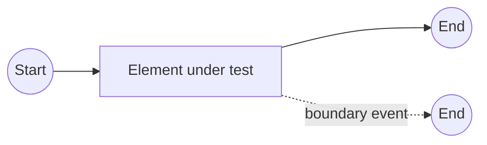

# BPMN element design tests

The suite contains 36 element directories, 128 design variants and 387 tests.
Each BPMN element type has its own directory and one or more `*_design.spec.ts` files.
Related event definitions and design variants are named scenarios in the element's
spec file; boundary event definitions are split into per-type spec files.
The suite covers the element types exposed by the current designer palette and
replacement menus; it does not attempt to cover BPMN metamodel types that have no
editor UI.

Every variant has three independent tests:

1. **Design:** open a new process, create the complete diagram through the UI,
   change the tested element's type or marker, download BPMN, and assert its semantic
   type, event definition, loop mode and DI. Branches, boundary hosts, pools, lanes,
   nested scopes and every connection are drawn through palette/context-pad actions
   and mouse interaction. No prebuilt BPMN is imported during setup.
2. **Properties:** edit General, Documentation and every applicable properties
   group; add two mappings/properties, remove one, validate/clear/save example JSON;
   download and import the BPMN and compare every properties-panel field.
3. **Deploy:** configure the element through the UI and deploy it. Accepted
   definitions must return a numeric key, version 1, and exactly the submitted XML
   on readback. Unsupported configurations must return HTTP 400, `BAD_REQUEST`,
   a specific diagnostic and a visible deployment error.

The suite uses real backend requests. It tests deployment and persistence, not
process execution or job completion. A deployment accepted by the backend does
not establish runtime support for every BPMN construct.

## Coverage

| Elements | Variants / properties |
| --- | --- |
| Task, user, service, send, receive, manual, script tasks | Plain, parallel and sequential multi-instance, standard loop; worker type/retries where exposed |
| Business rule task | DMN latest/version tag, job worker, implementation switching and removal of stale settings, loop markers |
| Call activity | Latest/version tag, parallel/sequential multi-instance, standard loop, business key override |
| User task | All assignment/schedule fields, literal and FEEL priority, Zen Form JSON validation, visual designer, save/import/cancel |
| Sub-process | Expanded/collapsed, loops and business key override |
| Event sub-process | Typed start; separate start-event scenarios for interrupting/non-interrupting message, timer, conditional, signal, escalation, error and compensation where offered |
| Transaction, ad-hoc sub-process | Transaction/cancel context; expanded/collapsed ad-hoc, completion condition, cancellation and loop markers |
| Start, end, intermediate catch/throw, boundary events | All replacement-menu event definitions; date/duration/cycle timers, interrupting/non-interrupting boundaries, global references and correlation keys where exposed |
| Gateways | Exclusive, parallel, inclusive, complex, event-based; event-based branches lead to catch events |
| Sequence flow | Plain, conditional FEEL, default |
| Process, participant, lane | Names/IDs, documentation, executable flag, version tag; expanded/empty pools, participant multiplicity; invalid and duplicate process IDs |
| Data object/store references | Properties and collection marker |
| Group, text annotation | Category/text, metadata and persistence |
| Association, message flow, data input/output associations | Connector properties, metadata and persistence |

The element directories contain no input `.bpmn` fixtures. Each spec's local
`create…Diagram` functions build the required context through the editor. Link
scenarios draw both the catch and throw event. Cancel scenarios create a transaction
and its internal path. Event subprocesses are drawn separately from normal sequence
flow. Diagram coverage and references are checked in the downloaded XML.

Import is used only after editing properties, to reload the XML produced by that
same test and verify persistence. The user-task form test also reloads its own
export. Tests never access the modeler's private service registry, inject BPMN XML
to arrange a scenario, or mutate the model outside the UI.

## Test structure

Each spec declares its scenarios with `test.describe` and gives every test a fresh
process through `test.beforeEach`. The setup, properties to edit, expected groups,
XML assertions and deployment outcome are explicit in that element's file.
Tests do not depend on another test having run or share a mutable element ID.

Shared helpers have narrow responsibilities:

- `processDesigner.ts`: creating a new process, individual palette/context-pad and
  connection gestures, selecting shapes/connections/containers, exporting XML and
  checking properties after reimport of that export.
- `propertiesPanel.ts`: locating controls, filling fields, opening groups,
  manipulating lists and capturing their visible values.
- `commonProperties.ts`: reusable property operations such as metadata, input and
  output mappings, business keys and multi-instance fields.
- `eventProperties.ts`: reference and timer controls explicitly chosen by a test.
- `bpmnAssertions.ts`: XML queries, reference integrity and diagram coverage.
- `processDeployment.ts`: submitting a deployment and separate assertions for
  saved definitions and validation errors.

Do not add BPMN-type switches, fixture-kind switches, a type registry, or a shared
scenario runner. Shared helpers must not infer an element's properties or expected
outcome from its type. A spec composes the relevant operations directly. An
operation used only by one element, such as a user-task assignment or a called
process binding, stays in that element's spec.

Prefer explicit test steps over configuration flags. Reuse a helper when it names
a coherent operation, rather than wrapping a single call. Keep invalid-input
assertions in their scenario; generic field filling must not recognize special
values and silently bypass persistence checks. Wait for UI/model state changes
instead of fixed delays. Assertions use visible controls, exported XML and real
API responses, without changing the model through private editor services.

## Known backend limitation

A root timer start event with **Duration** currently returns HTTP 500 with
`missing processInstanceKey for timer start event with duration`. Its deployment
scenario is an explicit expected failure against the intended HTTP 400 validation
contract. Design and properties tests still run normally. Update the local `test.fail` annotation and the deployment expectation in
`start_event/start_event_design.spec.ts` when the backend implements or validates
this case.

Other unsupported configurations call `expectDeploymentRejected` with their
specific diagnostic directly in the relevant test. They are tested, not skipped. A cancel end inside a transaction currently fails reference resolution; its
expected diagnostic records that backend behavior without treating it as a
successful deployment.

## Run

```sh
pnpm typecheck:e2e:live
pnpm test:e2e:live e2e/live/elements
pnpm test:e2e:live e2e/live/elements/user_task
E2E_BASE_URL=http://localhost:3000 pnpm test:e2e:live e2e/live/elements --workers=4
```

The existing live global setup supplies the run prefix and deploys shared fixtures.
Each process also gets a random suffix, so versions and IDs are isolated across
tests, retries and workers.

## Diagram

Diagram built through the UI (Mermaid approximation, not BPMN XML):



Gateway, link, collaboration and subprocess scenarios draw their branches, matching
link pairs, pools and nested processes through the UI as part of each test's setup.
